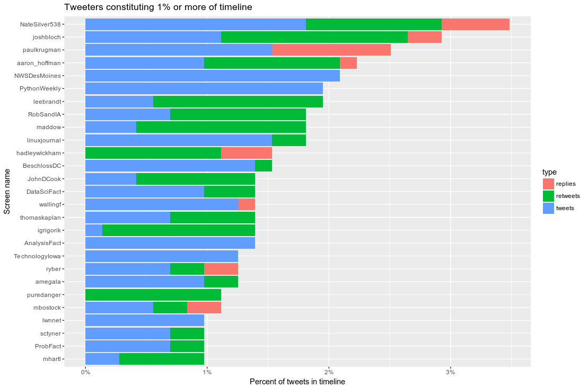

# Twitter timeline

### Retrieve and your Twitter timeline and plot the most active tweeters

Uses the [TwitteR](https://cran.r-project.org/package=twitteR) R package.

## Steps

1. Create a Twitter app at https://apps.twitter.com/app/new

2. Copy `credentials.R.example` to `credentials.R` and add the credentials for your Twitter app.

## Output

`report` summarizes tweets by `screenName` and shows you the most active tweeters in your timeline.

```
> head(report, n = 20)
# A tibble: 20 × 5
       screenName tweets retweets replies total
            <chr>  <int>    <int>   <int> <int>
1      DMRegister     73       15       0    88
2          marick     14       29       8    51
3     EmacsReddit     30        0       0    30
4             EFF     16        0       5    21
5       gigasquid      7       11       0    18
6     paulkrugman     10        0       7    17
7     BeschlossDC     16        0       0    16
8   aaron_hoffman     11        2       2    15
9         jonfavs      8        5       0    13
10      joshbloch      7        5       1    13
11 mathbabedotorg      4        9       0    13
12     MicrosoftR     13        0       0    13
13  jonneiderbach     12        0       0    12
14        Snowden      4        8       0    12
15            r5i      9        1       0    10
16       willywos      3        4       3    10
17       ACLUiowa      5        4       0     9
18     david_body      5        0       4     9
19  NateSilver538      3        3       3     9
20    deanwampler      3        5       0     8
```

`long_report` contains the same data but in a format convenient for plotting.

```
> head(long_report)
# A tibble: 6 × 3
   screenName   type count
        <chr>  <chr> <int>
1  DMRegister tweets    73
2      marick tweets    14
3 EmacsReddit tweets    30
4         EFF tweets    16
5   gigasquid tweets     7
6 paulkrugman tweets    10
```

The plot looks like this.


